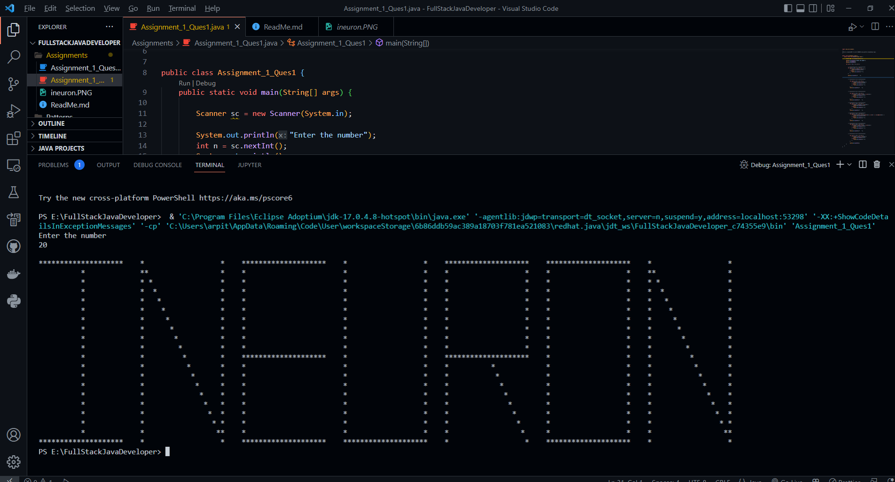
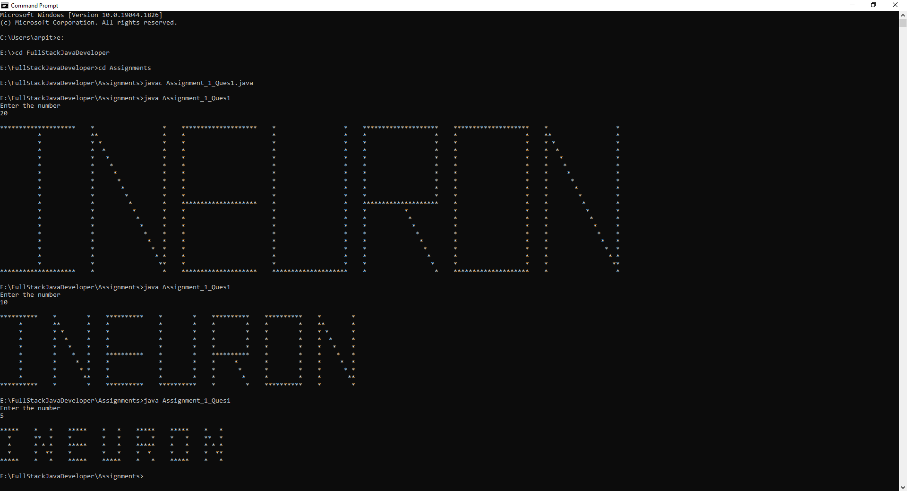
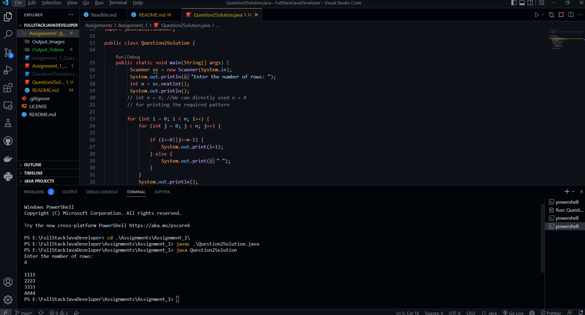
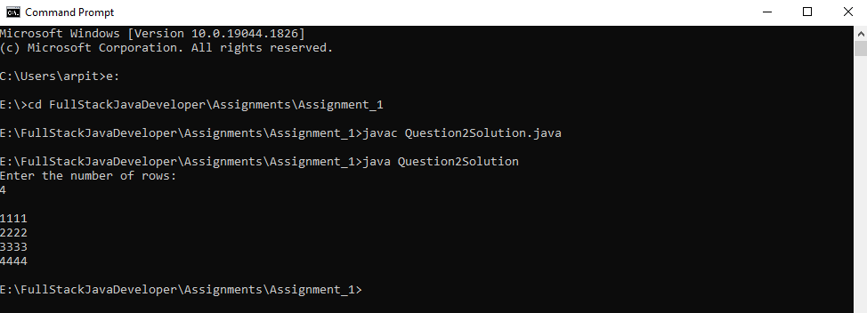
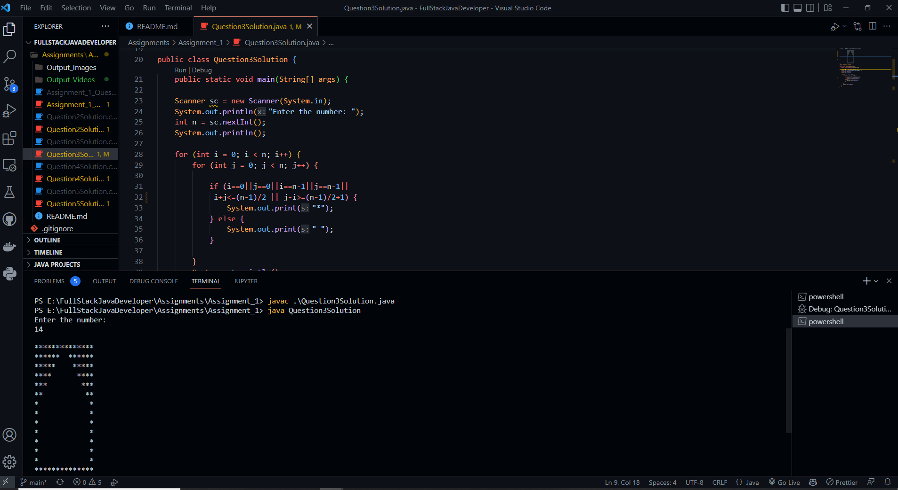
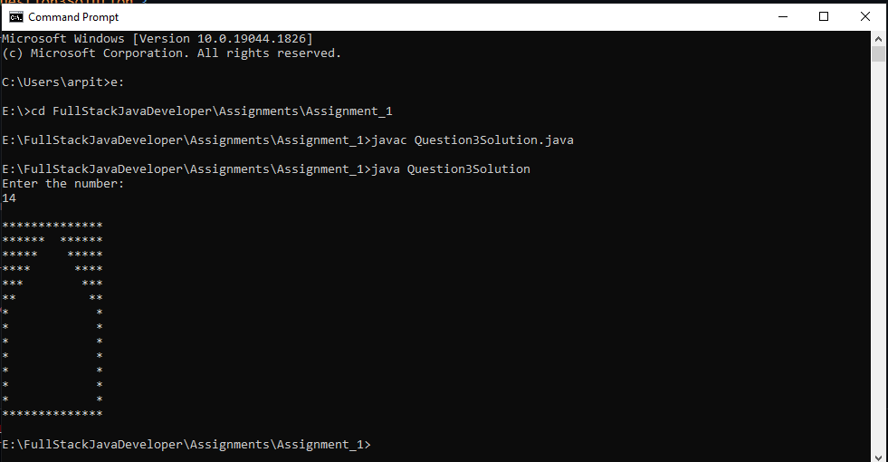
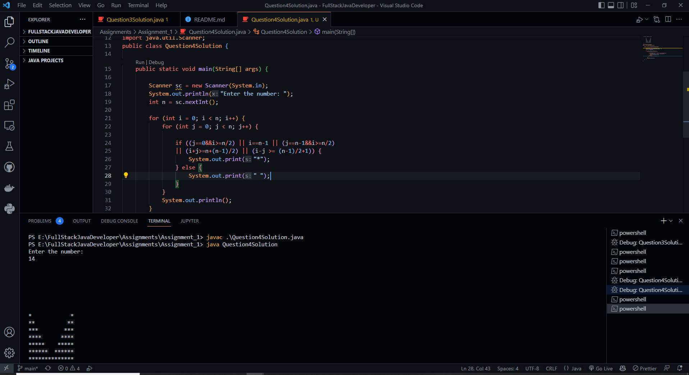
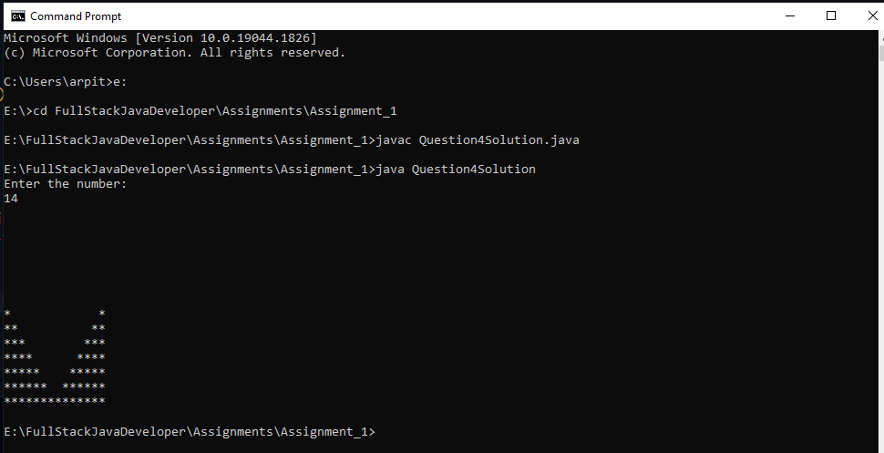
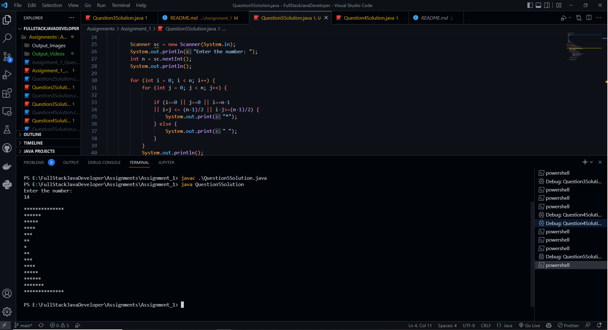
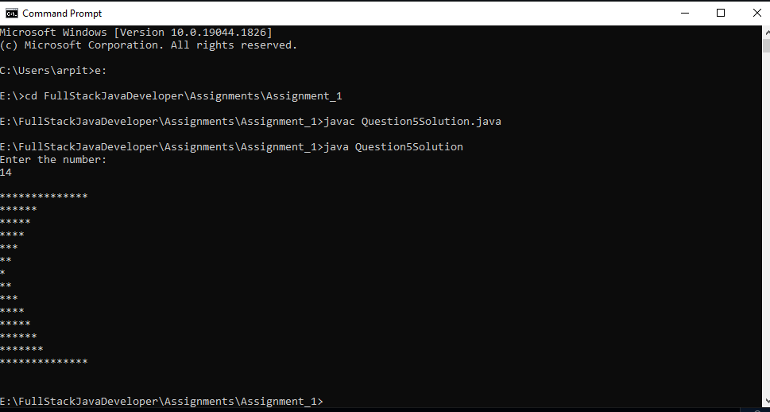

### Ques 1. Write a program(WAP) to print INEURON using pattern programming logic.

Ans: Output result for the Question 1 in Assignment 1 of Full Stack Java Developer:





### Ques 2. Write a program to print

### 1 1 1 1<br>
### 2 2 2 2<br>
### 3 3 3 3<br>
### 4 4 4 4<br><br>

Ans : Output result for the Question 2 in Assignment 1 of Full Stack Java Developer:
<br><br>




### Ques 3. WAP to print
```
                **************
                ******  ******
                *****    *****
                ****      ****
                ***        ***
                **          **
                *            *
                *            *
                *            *
                *            *
                *            *
                *            *
                *            *
                **************
```
Ans : Output result for the Question 3 in Assignment 1 of Full Stack Java Developer:
<br><br>





### Ques 4. WAP to print

        *            *
        **          **
        ***        ***
        ****      ****
        *****    *****  
        ******  ******
        **************

Ans : Output result for the Question 4 in Assignment 1 of Full Stack Java Developer:
<br><br>






### 5. WAP to print

    **************
    ******
    *****
    ****
    ***
    **
    *
    **
    ***
    ****
    *****
    ******
    *******
    **************

Ans : Output result for the Question 5 in Assignment 1 of Full Stack Java Developer:
<br><br> 




