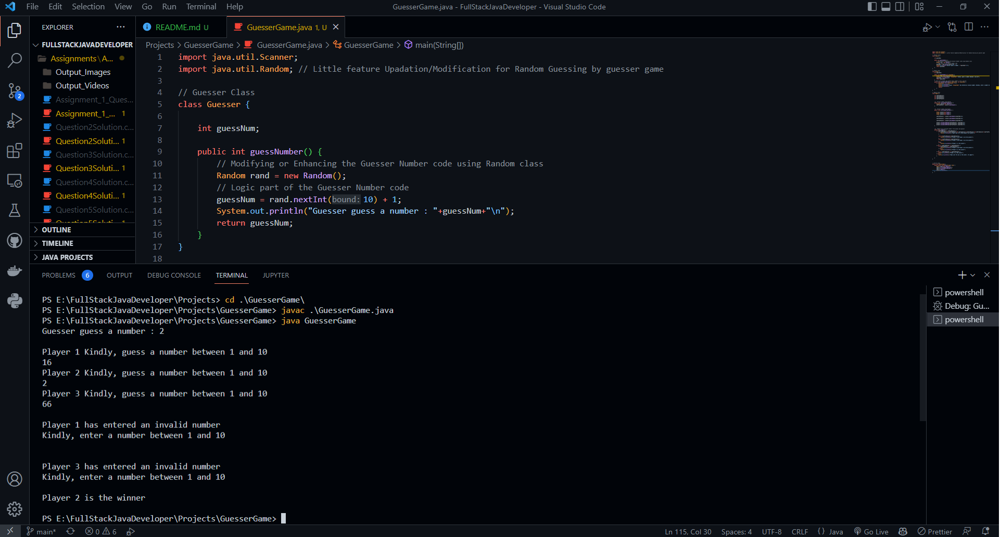
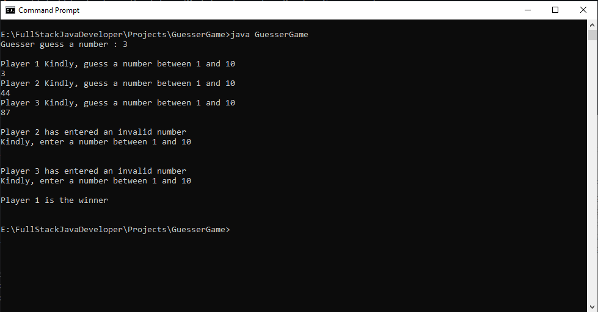

### Ques. Improvise the guesser game project which we have discussed in live class on 30th july class. Add the maximum feature you could add to it.

#### Ans:
Added features are :
1. Guesser guessing will be Random Generated number using the java.util.Random class.

Why I added this feature to make the game more unbaised.
Guesser Generate Random number we can hide that number and it will be more unbaised for all player.

2. I include ValidationMethod() to check if any player entered number below or beyond the range of number between 1 to 10

I'm trying to make a GUI based GuesserGame but it required the knowledge of JavaFx tool. Hopefully I can create it in future.